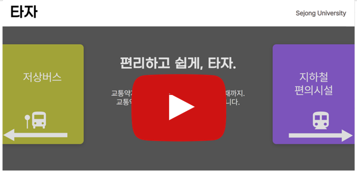
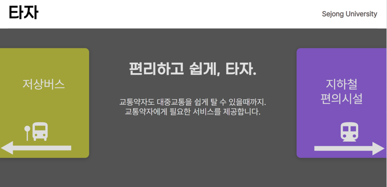
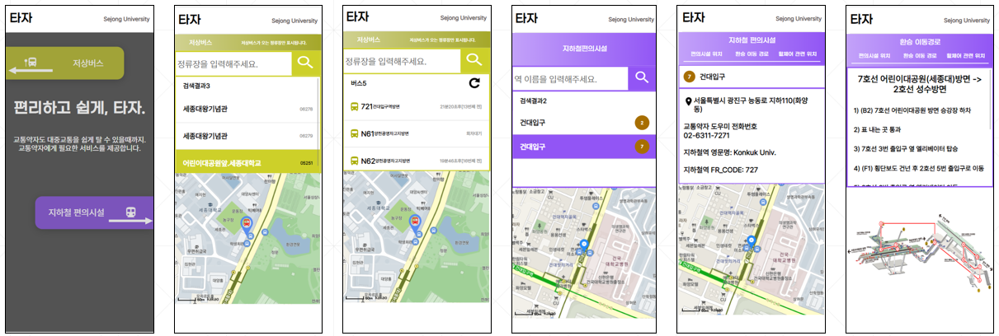
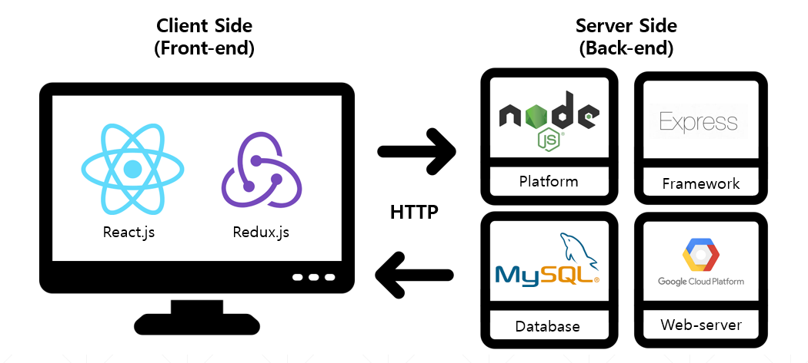

# Traffic-Information-Service-for-the-Disabled
교통약자를 위한 편의설비 위치제공 및 저상버스 안내 웹/앱 서비스

## 팀원
- [세종대학교 전자정보통신공학과 18학번 박상욱 (Backend)][9]
- [세종대학교 컴퓨터공학과 16학번 주이식 (Designer)][10]
- [세종대학교 컴퓨터공학과 18학번 류국봉 (DataBase)][11]
- [세종대학교 컴퓨터공학과 20학번 박규태 (Frontend)][12]

## 시연영상

   
  <b>▲ 프로젝트 시연영상</b>

## 서비스 예시

  

   

## 기술스택

  
  

## 참가 대회
[2022 One-Prize 공모전 GOOD MOBILITY 솔루션 (장애 + 모빌리티 테마 부문 참가)][1] 
2022 세종대학교 소프트웨어융합대학 학술제 (장려상 수상) 
2022 세종대학교 창의설계 경진대회

## 참고자료
- [서울 버스 노선정보 공공 API][2]
- [서울교통공사 역이용 안내도 API][3]
- [서울특별시 지하철 출입구 리프트 위치정보 API][4]
- [서울특별시 지하철 엘리베이터 위치정보 API][5]
- [서울특별시 지하철명 이름 검색 API][6]
- [교통약자 역사 내 엘리베이터 이동동선][7]
- [역사별 휠체어리프트 이동동선][8]

[1]: https://www.o-prize.com/index.php
[2]: http://api.bus.go.kr/contents/sub02/getBusPosByRtid.html 
[3]: https://www.data.go.kr/data/15004974/fileData.do
[4]: https://www.data.go.kr/data/15098159/openapi.do
[5]: https://www.data.go.kr/data/15098158/openapi.do
[6]: http://data.seoul.go.kr/dataList/OA-121/S/1/datasetView.do
[7]: https://data.kric.go.kr/rips/M_01_02/detail.do?id=391&service=trafficWeekInfo&operation=stinElevatorMovement&keywords=%ec%9d%b4%eb%8f%99%eb%8f%99%ec%84%a0&lcd=&mcd=
[8]: https://data.kric.go.kr/rips/M_01_02/detail.do?id=209&service=vulnerableUserInfo&operation=stationWheelchairLiftMovement&keywords=%ec%9d%b4%eb%8f%99%eb%8f%99%ec%84%a0&lcd=&mcd=
[9]: https://github.com/sw0501
[10]: https://github.com/jkey20
[11]: https://github.com/rkb429
[12]: https://github.com/KyuTae98
